[](https://www.python.org/)
[](https://opensource.org/licenses/Apache-2.0)
[](https://nos-tlplot.streamlit.app)
[](https://doi.org/10.5281/zenodo.17065214)
[](https://doi.org/10.5334/jors.635)


---

**NOS-TLPlot** is an open-source Python tool for **visualising Newcastle–Ottawa Scale (NOS) risk-of-bias assessments**.  
It converts NOS star ratings into **publication-ready traffic-light plots** and **10 specialized visualizations**, enabling reviewers and readers to interpret study-level risk-of-bias results clearly and reproducibly.
 
📂 **Code & Archive (Zenodo DOI):** [10.5281/zenodo.17065214](https://doi.org/10.5281/zenodo.17065214)

📃 **Software Metapaper (Journal of Open Research Software DOI):** [10.5334/jors.635](https://doi.org/10.5334/jors.635)

---

## ✨ Key Features

- **12 Visualization Types**: Traffic-light plots, radar charts, heatmaps, dot profiles, donut charts, lollipop charts, line plots, and more  
- **Publication-Quality Output**: Export figures in `.png`, `.pdf`, `.svg`, `.eps` formats  
- **Multiple Themes**: Traffic-light and grayscale themes for various publication requirements  
- **Interactive Web App**: Built with Streamlit for simple data upload, preview, and figure export  
- **Command Line Interface**: For batch processing and automated figure generation  
- **Domain-Specific Risk Assessment**: Automatically converts NOS stars (0–9) to categorical RoB (Low/Moderate/High)  
- **Customizable Output**: Adjustable figure sizes, line thickness, and color themes  
- **Scope-Limited**: Designed exclusively for NOS evaluations of non-randomised studies  

---

## USE

- Vercel web leading to Streamlit → [nos-tlplot.vercel.app](https://nos-tlplot.vercel.app)


Vercel user-interface

---

- To directly use it → [nos-tlplot.streamlit.app](https://nos-tlplot.streamlit.app)


Streamlit user-interface

---

## 📥 Installation (Optional)

### Prerequisites
- This code is based on Python-3.12.3 (however works with **3.11+**)
- `pip` package manager  

### Installation Steps

```bash
# Clone the repository
git clone https://github.com/aurumz-rgb/NOS-TLPlot.git
cd NOS-TLPlot

# Install dependencies
pip install -r requirements.txt
````

---

## ⚡ Usage (directly via Streamlit web OR)

### 1️⃣ Streamlit Web App (Recommended)

```bash
cd NOS-TLPlot
streamlit run app.py
```

**Features:**

* Upload CSV/Excel files
* Real-time visualization preview
* Choose from 12 plot types
* Download publication-ready figures in multiple formats
* Theme switcher (Traffic-light / Grayscale)

**Steps:**

1. Run the above command
2. Open the local Streamlit URL (default: `http://localhost:8501`)
3. Upload your NOS dataset
4. Choose visualization and theme
5. Preview and download figures

---

### 2️⃣ Python Script (Command Line) (For Reviewers to ensure reproducibility and Transparency)

```bash
cd NOS-TLPlot
# Basic usage
python3 nos_tlplot.py sample.csv output.png

# With theme
python3 nos_tlplot.py sample.csv output-traffic-light.png gray
```

---

### 🧩 Python Sample

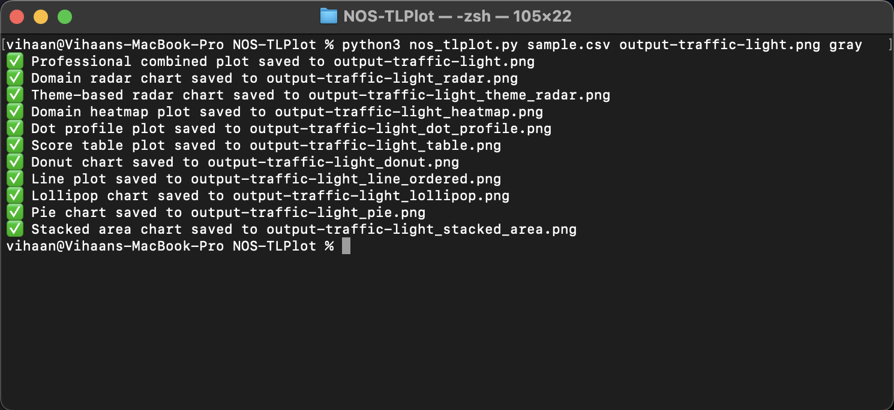

---

**Parameters:**

| Parameter     | Description                                         |
| ------------- | --------------------------------------------------- |
| `input_file`  | Path to CSV/Excel file containing NOS data          |
| `output_file` | Output file name and extension                      |
| `theme`       | Optional theme: `traffic_light` (default) or `gray` |

**Generated Outputs:**

| File                 | Description                             |
| -------------------- | --------------------------------------- |
| `_traffic-light.png` | Classic traffic-light bubble plot       |
| `_radar.png`         | Radar chart of domain scores            |
| `_heatmap.png`       | Color heatmap for domain-level bias     |
| `_dot_profile.png`   | Dot-style bias visualization            |
| `_table.png`         | Summary table with domain scores        |
| `_donut.png`         | Donut chart of overall bias levels      |
| `_line_ordered.png`  | Sequential line plot of domain bias     |
| `_lollipop.png`      | Lollipop chart for comparative bias     |
| `_pie.png`           | Proportional risk-of-bias pie           |
| `_stacked_area.png`  | Stacked area visualization over domains |
| `_star_dist.png`     | Star distribution visualization         |

---

##  Input Data Format

Your file should have these columns:

| Column Name                  | Description      | Valid Range           |
| ---------------------------- | ---------------- | --------------------- |
| `Author, Year`               | Study identifier | Text                  |
| `Representativeness`         | Domain 1         | 0–1                   |
| `Non-exposed Selection`      | Domain 2         | 0–1                   |
| `Exposure Ascertainment`     | Domain 3         | 0–1                   |
| `Outcome Absent at Start`    | Domain 4         | 0–1                   |
| `Comparability (Age/Gender)` | Domain 5         | 0–2                   |
| `Comparability (Other)`      | Domain 6         | 0–2                   |
| `Outcome Assessment`         | Domain 7         | 0–1                   |
| `Follow-up Length`           | Domain 8         | 0–1                   |
| `Follow-up Adequacy`         | Domain 9         | 0–1                   |
| `Total Score`                | Sum of stars     | 0–9                   |
| `Overall RoB`                | Risk of bias     | Low / Moderate / High |

> 💡 *Tip:* Always include your raw NOS scoring table in supplementary materials for reproducibility.

---

## 🎨 Visualization Types

1. **Traffic-light bubble Plot** – Standard bubble risk-of-bias visualization.
2. **Radar Chart** – Displays study performance across domains.
3. **Heatmap** – Visual overview of domain-level variation.
4. **Dot Profile** – Shows domain-level bias in compact form.
5. **Donut Chart** – Visualizes proportions of bias categories.
6. **Lollipop Plot** – Combines numerical and categorical domains.
7. **Stacked Area Chart** – Displays temporal or comparative changes.
8. **Pie Chart** – Quick overview of overall bias distribution.
9. **Line Ordered Plot** – Connects domain bias levels for each study.
10. **Table View** – Tabular representation of bias domains.
11. **Radar (Thematic)** – Theme-adapted radar chart (gray/colored).
12. **Star distribution** – Star-adapted plot (only traffic-light).

Note: Radar Plots and Dot Profile plot is only limited to 5 studies.

---

## NOS Scoring → Risk-of-Bias Conversion

| Total Stars | Interpretation         | Risk Category    |
| ----------- | ---------------------- | ---------------- |
| 7–9         | High-quality study     | **Low RoB**      |
| 4–6         | Moderate-quality study | **Moderate RoB** |
| 0–3         | Poor-quality study     | **High RoB**     |

> Conversion follows Newcastle–Ottawa Scale standards for cohort/case-control/cross-sectional designs.

---

## 🔧 Technical Details

* **Core Engine:** `matplotlib`, `seaborn`, `numpy`, `pandas`
* **Web UI:** `streamlit`
* **Table Rendering:** `matplotlib.table`
* **Plot Layout Management:** `GridSpec`
* **Color Systems:** Custom mcolors, traffic-light mapping
* **Data Handling:** CSV/Excel file input with automatic parsing
* **Batch Plotting:** Parallel generation for multiple figure types
* **Export Quality:** 300 DPI (default), publication-ready vector output


---

### 🧩 Repository Structure

```
NOS-TLPlot/
├── app.py                 # Streamlit web app
├── nos_tlplot.py          # Main plotting engine
├── requirements.txt       # Dependencies
├── README.md              # Project documentation
├── citation.cff           # Citation metadata
├── LICENSE                # Apache 2.0 License
├── examples               # All the Sample outputs

```

---

##  Support

*  For usage questions, open a [Discussion](https://github.com/aurumz-rgb/NOS-TLPlot/discussions)
*  For bug reports or feature requests, open an [Issue](https://github.com/aurumz-rgb/NOS-TLPlot/issues)
*  Email: [mail](mailto:pteroisvolitans12@gmail.com)


---


## 📄 Acknowledgment:

I sincerely thank the **Journal of Open Research Software (JORS)** for providing a full publication waiver supporting this software.


---

## 🎯 Citation

NOS-TLPlot Software code is cited:

**Sahu, V. (2025). NOS-TLPlot: Visualization Tool for Newcastle–Ottawa Scale in Meta-Analysis (v2.0.3). Zenodo.**
DOI: [10.5281/zenodo.17065214](https://doi.org/10.5281/zenodo.17065214)


NOS-TLPlot Software Metapaper is cited:

**Sahu, V. (2026). NOS-TLPlot: A Specialized Python Tool for Visualizing Newcastle–Ottawa Scale Risk-of-Bias Assessments. *Journal of Open Research Software*, 14(1), 7.**
DOI: [10.5334/jors.635](https://doi.org/10.5334/jors.635)

```bibtex
@software{Sahu2025,
  author = {Sahu, Vihaan},
  title = {NOS-TLPlot: Visualization Tool for Newcastle–Ottawa Scale in Meta-Analysis (v2.0.3)},
  year = {2025},
  doi = {10.5281/zenodo.17065214},
  url = {https://doi.org/10.5281/zenodo.17065214},
  version = {2.0.3}
}

@article{Sahu2026,
  author = {Sahu, Vihaan},
  title = {NOS-TLPlot: A Specialized Python Tool for Visualizing Newcastle–Ottawa Scale Risk-of-Bias Assessments},
  journal = {Journal of Open Research Software},
  volume = {14},
  number = {1},
  pages = {7},
  year = {2026},
  doi = {10.5334/jors.635},
  url = {https://doi.org/10.5334/jors.635}
}
```


---

# Sample Plots

All the Output Sample plots

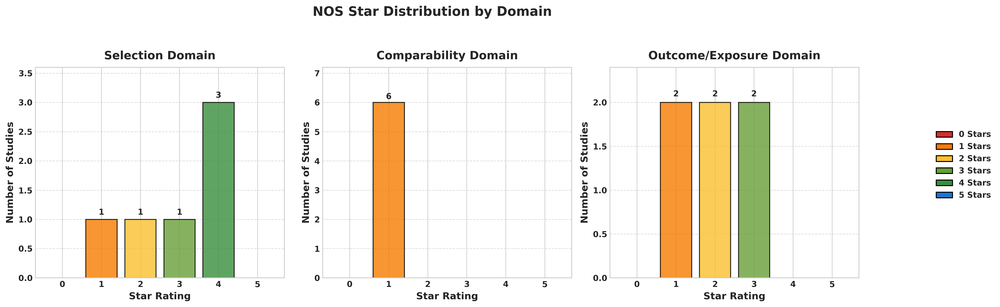
NOS star plot


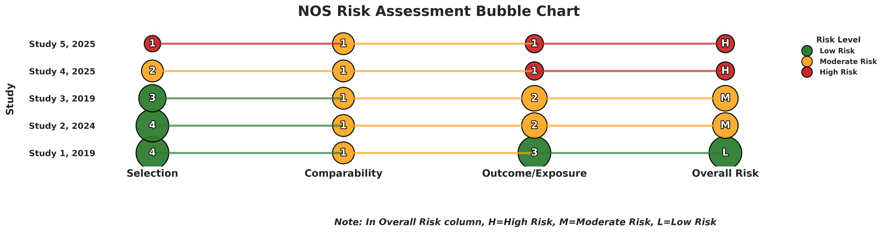
NOS bubble plot


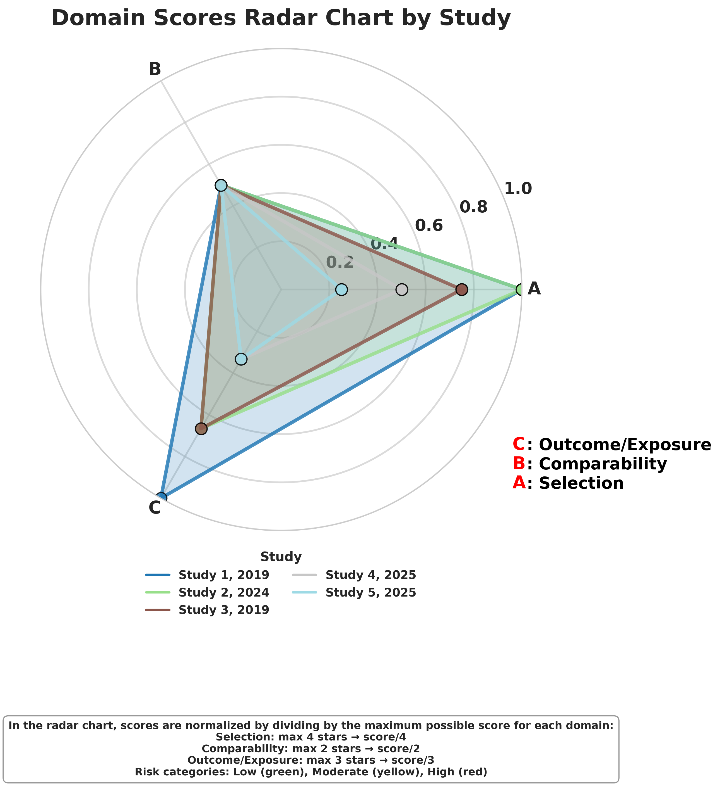
Domain Scores Radar Chart by Study


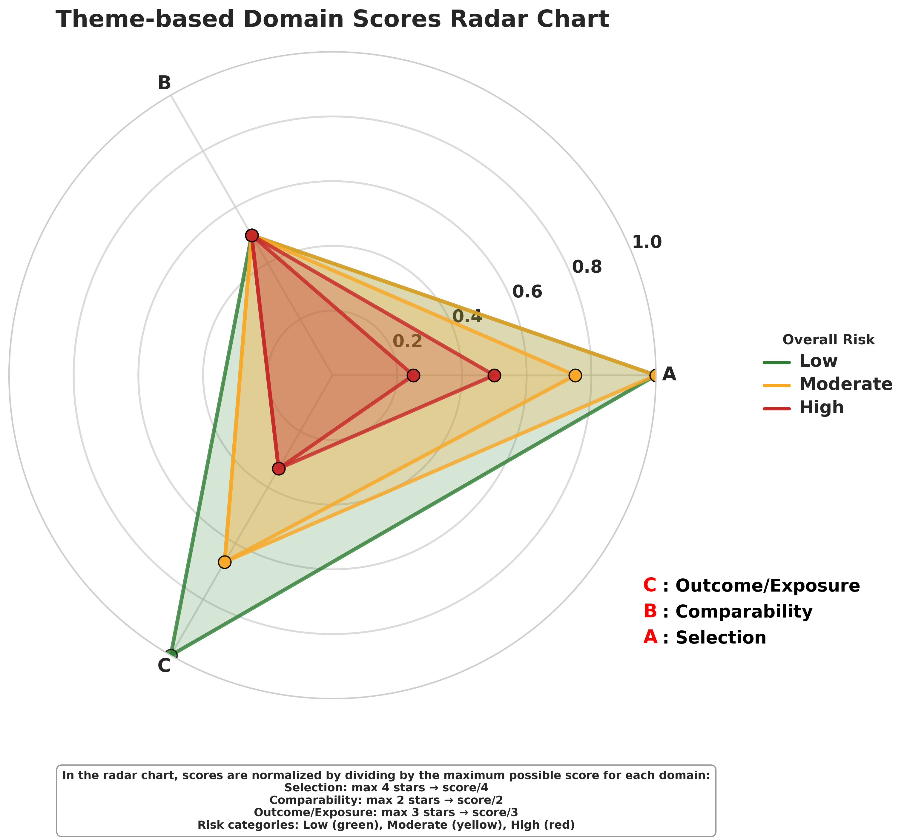
Theme-based Domain Scores Radar Chart


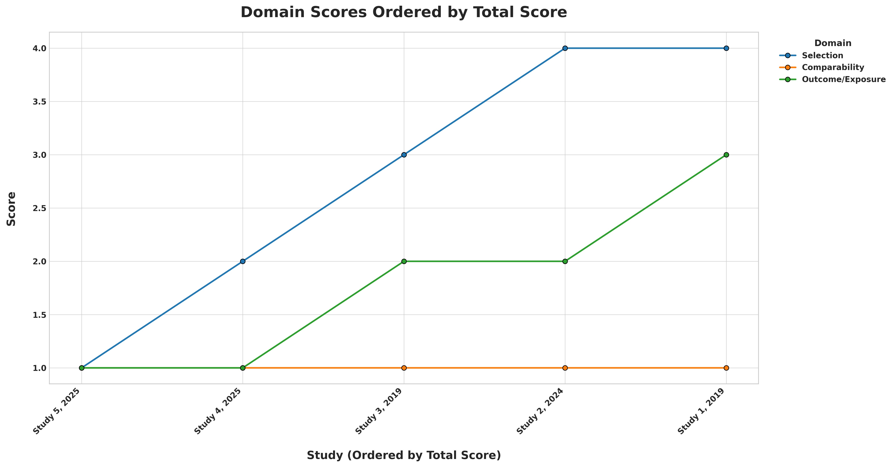
Domain Scores Ordered by Total Score


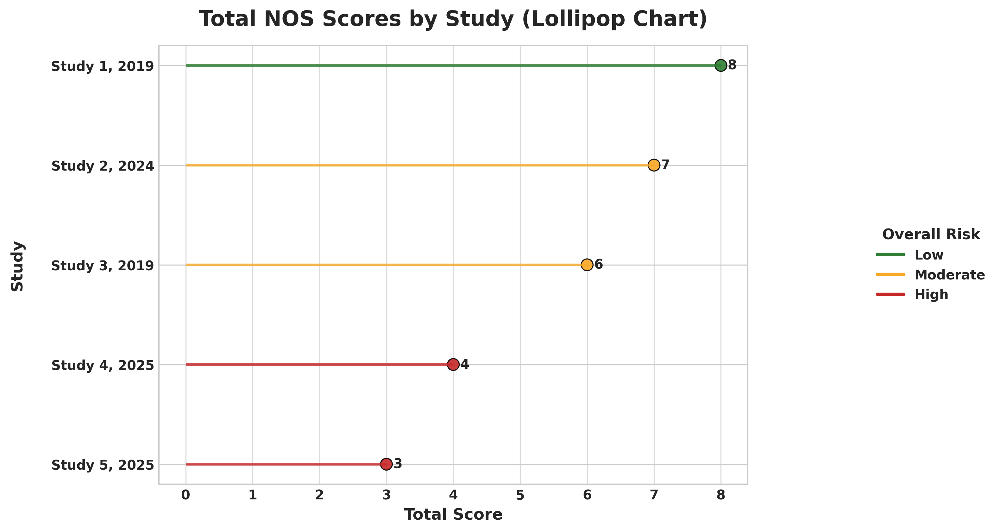
Total NOS Scores by Study (Lollipop Chart)


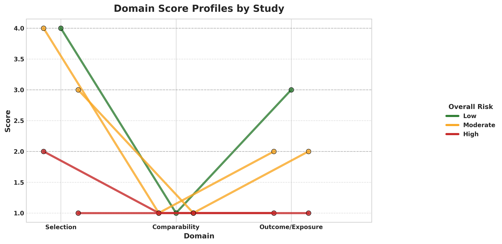
Domain Score Profiles by Study


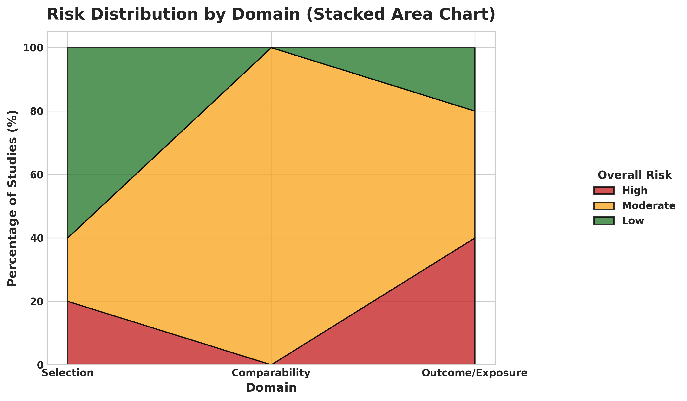
Risk Distribution by Domain (Stacked Area Chart)


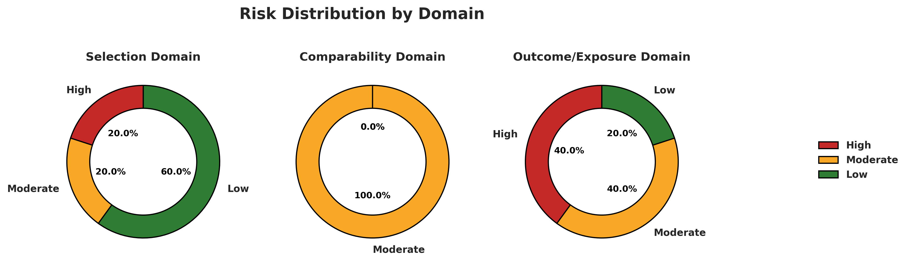
Risk Donut Distribution by Domain


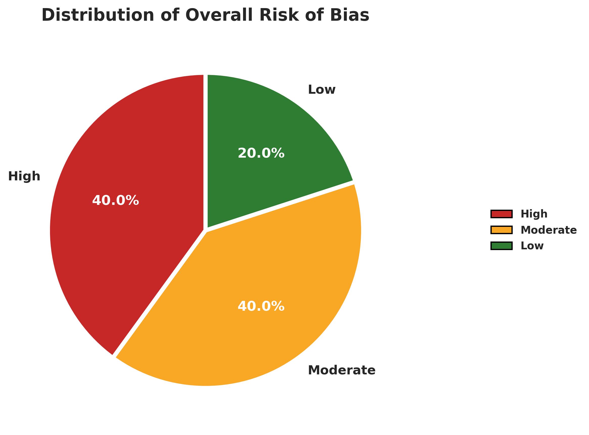
Distribution of Overall Risk of Bias Pie


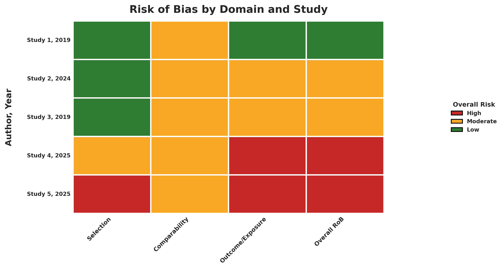
Risk of Bias by Domain and Study by heatmap


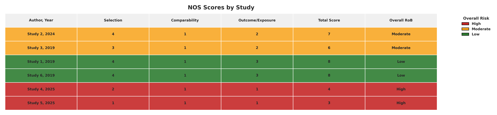
NOS Scores by Study


